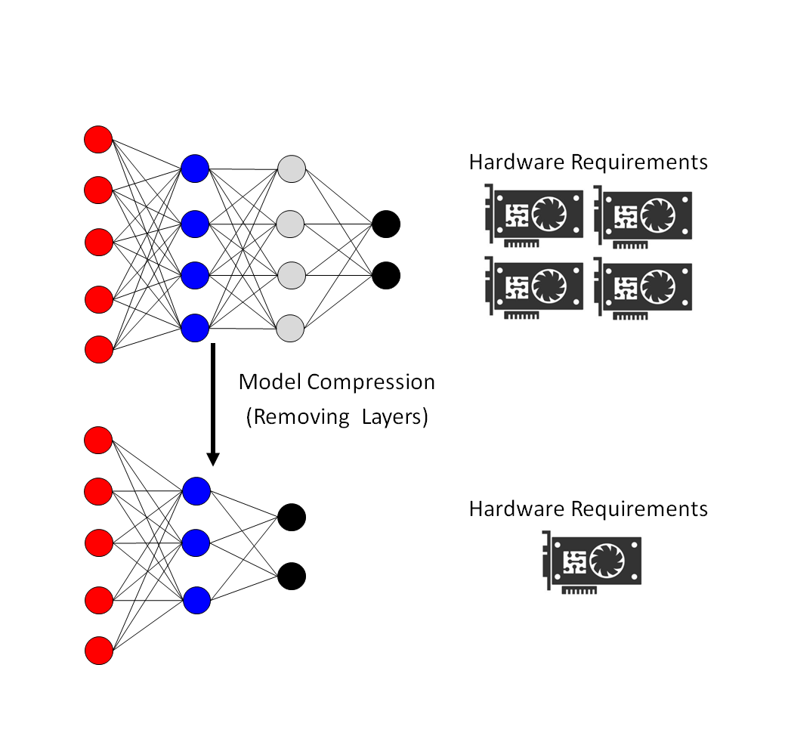
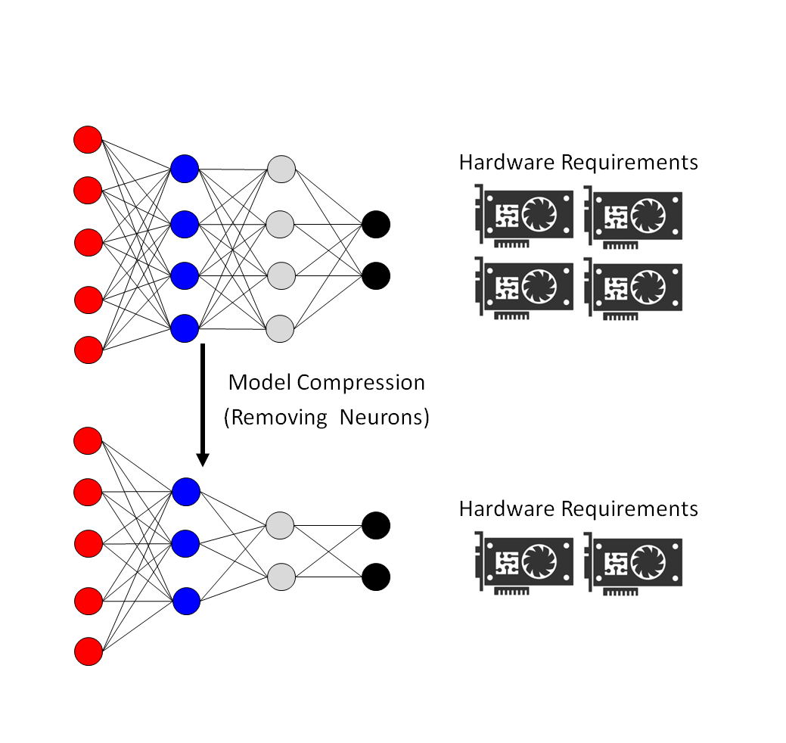

In my GitHub, you will find the source code used in my publications (listed below) that include strategies for compression and acceleration of deep networks and compact representations for large datasets. Alternatively, you can check these projects and publications on my [homepage](https://homepages.dcc.ufmg.br/~arturjordao/).

<!--
 
-->

### Selected Publications
* Artur Jordão, Maiko Lie, Fernando Yamada, William Robson Schwartz: [DepthWise Neural Architecture Search.](https://arxiv.org/pdf/2004.11178.pdf) (Accepted for publication). 
In: International Conference on Pattern Recognition (ICPR), 2020, Milan, Italy. [GitHub](https://github.com/arturjordao/DepthWiseArchitectureSearch)
* Artur Jordão, Fernando Yamada, William Robson Schwartz: [Deep Network Compression based on Partial Least Squares.](https://homepages.dcc.ufmg.br/~arturjordao/Files/Papers/Neurocomputing_2019.pdf) 
In: Neurocomputing, 2020. [GitHub](https://github.com/arturjordao/PruningNeuralNetworks)
* Artur Jordão, Maiko Lie, William Robson Schwartz: [Discriminative Layer Pruning for Convolutional Neural Networks.](https://homepages.dcc.ufmg.br/~arturjordao/Files/Papers/JSTSP_2019.pdf) 
In: IEEE Journal of Selected Topics In Signal Processing, 2020. [GitHub](https://github.com/arturjordao/DepthWisePruning)
* Artur Jordão, Ricardo Barbosa Kloss, William Robson Schwartz: [Latent HyperNet Exploring the Layers](https://homepages.dcc.ufmg.br/~arturjordao/Files/Papers/IJCNN_2018.pdf). In: International Joint Conference on Neural Networks (IJCNN), 2018, Rio de Janeiro, Brazil. [GitHub](https://github.com/arturjordao/LatentHyperNet)

