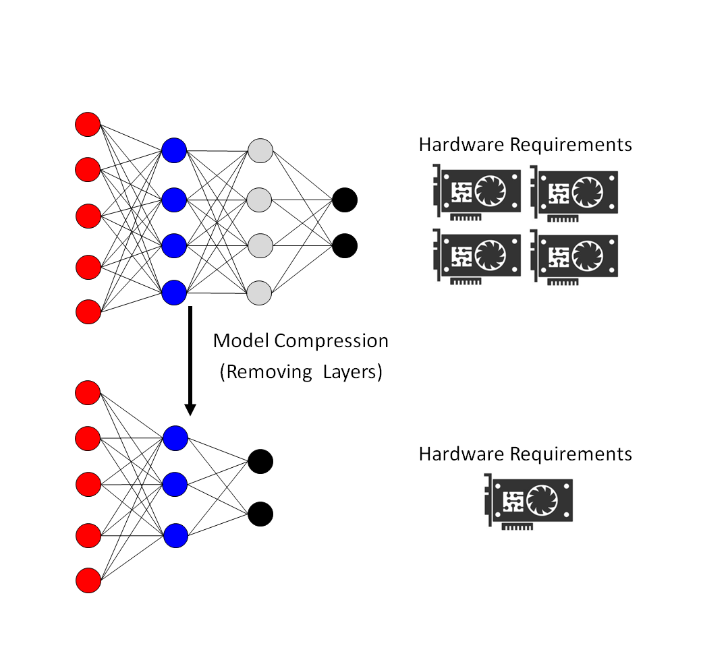
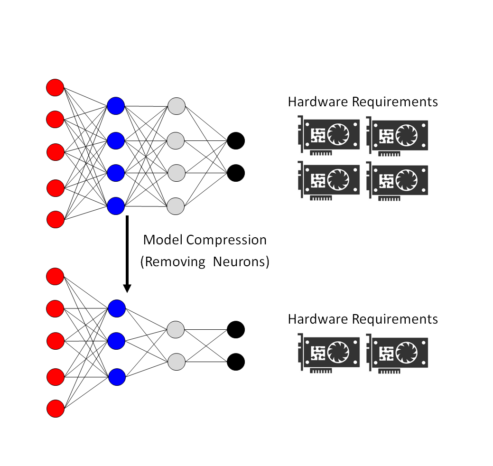

In my GitHub, you will find the source code used in my publications (listed below) that include strategies for compression and acceleration of deep networks, and compact representations for large datasets. Alternatively, you can check these projects and publications on my [homepage](http://arturjordao.github.io/).

<!--
 
-->

### Selected Publications
* Keith Ando Ogawa, Bruno Lopes Yamamoto, Lucas Lauton de Alcantara, Lucas Pellicer, Rosimeire Pereira Costa, Edson Bollis, Anna Helena Reali Costa and Artur Jordao. [Layer-wise LoRA fine-tuning: a similarity metric approach](https://arxiv.org/abs/2602.05988). In: International Conference on Pattern Recognition (ICPR), 2026, Lyon, France. [GitHub](https://github.com/c2d-usp/Layer-wise-LoRA-with-CKA).
* Vinicius Yuiti Fukase, Heitor Gama, Barbara Bueno, Lucas Libanio, Anna Helena Reali Costa, and Artur Jordao. [When to Prune? The Importance of Timing in Data Efficiency Training](https://arturjordao.github.io/Files/Papers/ICPR_2026_ViniciusFukase.pdf). In: International Conference on Pattern Recognition (ICPR), 2026, Lyon, France. [GitHub](https://github.com/ViniFukase/WhenToPrune).
* Carolina Tavares, Leandro Mugnaini, Gustavo Henrique do Nascimento, Ian Pons, Keith Ogawa, Guilherme Stern, Lucas Libanio, Aline Paes, Anna Helena Reali Costa and Artur Jordao. [Tiny Titans: Efficient Large Vision, Language and Multimodal Models through Pruning](https://github.com/arturjordao/TinyTitans/blob/main/slides-and-paper/Paper.pdf). In: Conference on Graphics, Patterns and Images (SIBGRAPI) Tutorial Track, 2025, Salvador, Brazil. [GitHub](https://github.com/arturjordao/TinyTitans)
* Gustavo Henrique do Nascimento, Ian Pons, Anna H. Reali Costa and Artur Jordao. [Pruning Everything, Everywhere, All at Once](https://arxiv.org/abs/2506.04513). In: International Joint Conference on Neural Networks (IJCNN), 2025, Rome, Italy. [GitHub](https://github.com/NascimentoG/PruningEverything)
* Leandro Giusti Mugnaini, Bruno Yamamoto, Lucas Lauton, Victor Zacarias, Edson Bollis, Lucas Pellicer, Anna H. Reali Costa and Artur Jordao. [Efficient LLMs with AMP: Attention Heads and MLP Pruning](https://arxiv.org/abs/2504.21174). In: International Joint Conference on Neural Networks (IJCNN), 2025, Rome, Italy. [GitHub](https://github.com/c2d-usp/Efficient-LLMs-with-AMP/)
* Ian Pons, Bruno Yamamoto, Anna H. Reali Costa, Artur Jordão. [Effective Layer Pruning Through Similarity Metric Perspective](https://openreview.net/pdf?id=7DPNITf7ui). In: International Conference on Machine Learning (ICML), 2024, Viena, Áustria. [GitHub](https://github.com/IanPons/CKA-Layer-Pruning)
* Artur Jordão, George Araújo, Helena de Almeida Maia and Hélio Pedrini. [When Layers Play the Lottery, all Tickets Win at Initialization](https://openaccess.thecvf.com/content/ICCV2023W/RCV/papers/Jordao_When_Layers_Play_the_Lottery_all_Tickets_Win_at_Initialization_ICCVW_2023_paper.pdf). In: International Conference on Computer Vision (ICCV), 2023, Paris, France.

Word cloud illustrating the content of my papers.

